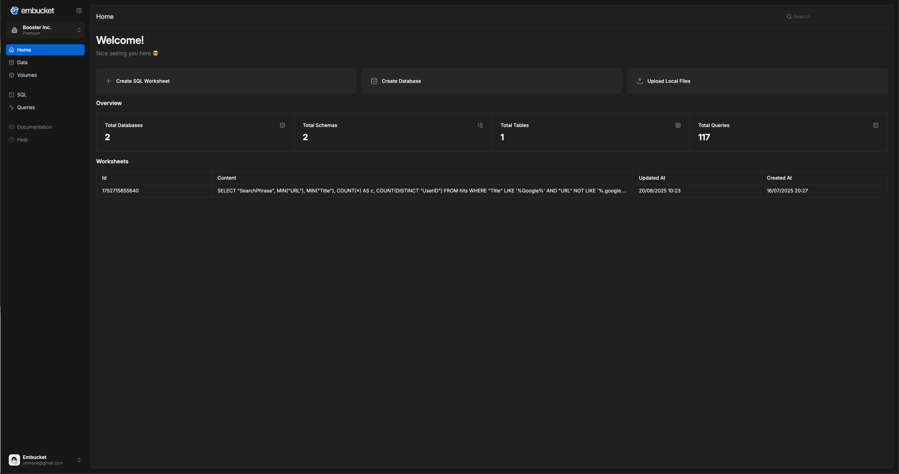

import { Aside, Steps } from '@astrojs/starlight/components';

This guide shows you how to start Embucket and run your first query in under 5 minutes. You use Embucket's single-binary architecture to reach your first "magic moment" quickly.

Read this guide to:

- Start Embucket with zero external dependencies
- Execute SQL queries using the web dashboard
- Create and query your first table

This guide doesn't cover production deployment or advanced configuration options.

## Step 1: Start Embucket

Start the Embucket server:

```bash
docker run --name embucket --rm -p 8080:8080 -p 3000:3000 embucket/embucket
```

**Done.** You need no external dependencies, databases, or complex configuration. Embucket runs everything in-memory for this quick start. This zero-disk architecture requires no external storage.

Embucket displays output like:

```
{"timestamp":"2025-07-01T15:35:05.687708Z","level":"INFO","fields":{"message":"Listening on http://0.0.0.0:8080"},"target":"embucketd"}
{"timestamp":"2025-07-01T15:35:05.687807Z","level":"INFO","fields":{"message":"Listening on http://0.0.0.0:3000"},"target":"embucketd"}
```

<Aside type="caution">

The default Docker configuration uses file storage for metadata and data. Don't use this
configuration for production. See the [configuration guide](/essentials/configuration) for
production options.

</Aside>

Embucket runs and exposes three services:

- Snowflake-compatible REST API at `http://127.0.0.1:3000`
- Apache Iceberg catalog REST API at `http://127.0.0.1:3000/catalog`
- Web UI Dashboard at `http://127.0.0.1:8080`

## Step 2: Execute your first query

Open the browser to `http://127.0.0.1:8080` to explore Embucket's web interface, query editor, and data catalog. The interface resembles Snowflake's interface.

<Aside type="tip">Use `embucket` as both the username and password to log in.</Aside>



Create a table and insert data using the query editor in the web UI or via snowflake-cli. Navigate to the query editor in the browser and paste this SQL:

<Steps>

1. **Create a table**

   ```sql
   CREATE TABLE employees (id INT, name STRING, department STRING, salary DECIMAL(10,2));
   ```

2. **Insert data**

   ```sql
   INSERT INTO employees VALUES (1, 'Alice Johnson', 'Engineering', 95000.00), (2, 'Bob Smith', 'Marketing', 75000.00), (3, 'Carol Davis', 'Engineering', 98000.00);
   ```

3. **Query your data**

   ```sql
   SELECT department, AVG(salary) as avg_salary FROM employees GROUP BY department ORDER BY avg_salary DESC
   ```

</Steps>

Embucket uses [Apache Iceberg](https://iceberg.apache.org/)—an open table format—to store your data and [SlateDB](https://slatedb.io/)—a cloud-native storage engine—to store your metadata.
