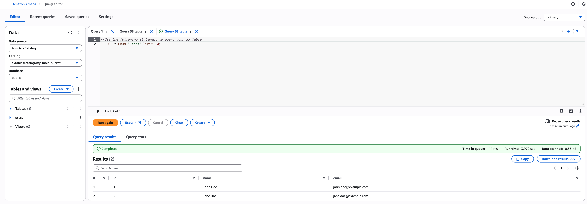

import { Aside } from '@astrojs/starlight/components';

This guide demonstrates how to use AWS S3 table buckets as a storage for your data. It is not only possible to use regular S3 buckets but explicitly using S3 table buckets get you some additional benefits like table maintenance and other features provided by AWS S3 table buckets.

## Step 1: Create an S3 table bucket

To create an S3 table bucket, you can use the AWS Management Console, AWS CLI, or AWS SDKs.

I'll use AWS CLI to create an S3 table bucket.

```bash
aws s3tables create-table-bucket --name my-table-bucket --region us-east-2
```

It will return something like this:

```json
{
  "arn": "arn:aws:s3tables:us-east-2:XXX:bucket/my-table-bucket"
}
```

This is enough to use the S3 table bucket as a storage for your data.

## Step 2: Create a volume

To create a volume, you can use UI or internal API.

With the following command we create a volume of type `s3-tables`. It's different from regular S3 volumes in that it uses AWS S3 table bucket as a storage for your data. Since S3 table buckets can contain namespaces and tables, we need to provide additional information to the volume. Namely, we need to provide the name of the table bucket and the ARN of the table bucket. Name becomes a database and ARN is used to identify the table bucket.

<Aside type="caution">
  S3 table bucket volume maps to only one database! You can specify database name when creating
  volume.
</Aside>

```bash
http http://localhost:3000/v1/metastore/volumes ident=demo type=s3-tables database=demo credentials:='{"credential_type":"access_key","aws-access-key-id":"XXX","aws-secret-access-key":"XXX"}' 'arn=arn:aws:s3tables:us-east-2:XXX:bucket/my-table-bucket'
```

Here `demo` is the identifier of the volume, `s3-tables` is the type of the volume, `XXX` is the access key ID and secret access key of the AWS account, `demo` is the name of the database and `arn:aws:s3tables:us-east-2:XXX:bucket/my-table-bucket` is the ARN of the S3 table bucket. Embucket will use arn to identify the S3 table bucket. region and table bucket name.

## Step 3: Create a table, load data and query it

To create a table one can use either UI or `snowflake-cli`. We will use `snowflake-cli` to create a table.

```
$ snow sql -c local

CREATE SCHEMA demo.public;
+-------+
| count |
|-------|
| 0     |
+-------+


CREATE TABLE demo.public.users (
    id INT,
    name VARCHAR(100),
    email VARCHAR(100)
) AS VALUES (1, 'John Doe', 'john.doe@example.com'), (2, 'Jane Doe', 'jane.doe@example.com');
+-------+
| count |
|-------|
| 2     |
+-------+
```

Now we can query the table using same `snowflake-cli` session:

```
> SELECT * FROM demo.public.users;
+--------------------------------------+
| id | name     | email                |
|----+----------+----------------------|
| 1  | John Doe | john.doe@example.com |
| 2  | Jane Doe | jane.doe@example.com |
+--------------------------------------+
```

We also can open AWS Console and check that the table is created. Open AWS Console and navigate to S3 table bucket. In a table bucket used to create a volume we should see a namespace `demo` and a table `users`. Select the table and hit "Query table with Athena". In the SQL editor we should see the same query we used in `snowflake-cli` session:


